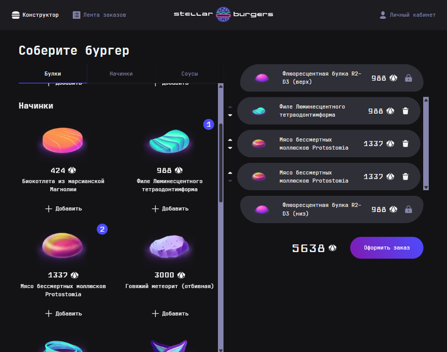
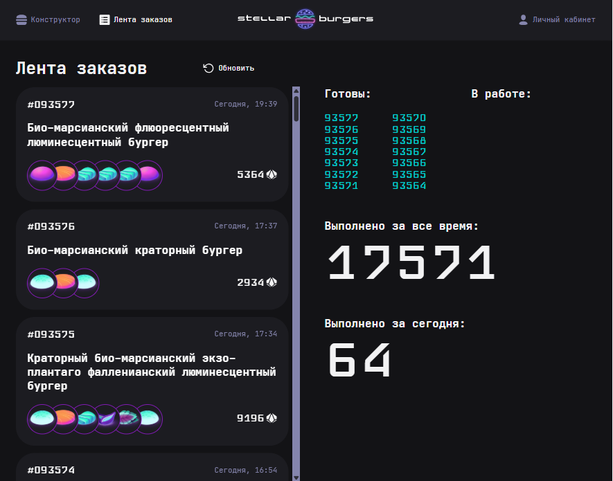
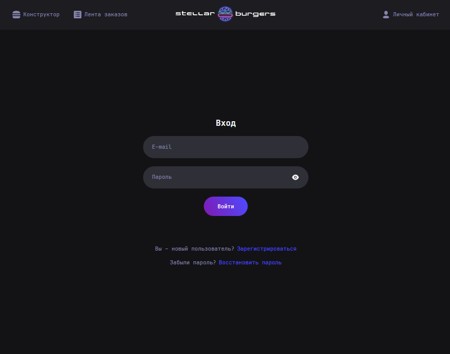

# Бургерная Stellar burgers (React, Redux Toolkit, React Router)

SPA приложение, в ходе которого:

- был подключен роутер и реализованы маршруты с помощью React Router
- добавлено глобальное состояние и подключено к страницам с помощью Redux Toolkit
- реализован механизм авторизации и защиты личного кабинета пользователя
- реализовано взаимодействие с API





## Стек

      

## Установка и запуск

Для установки и запуска проекта необходимо выполнить команды

```
npm install
npm run start
```

или

```
yarn
yarn start
```
